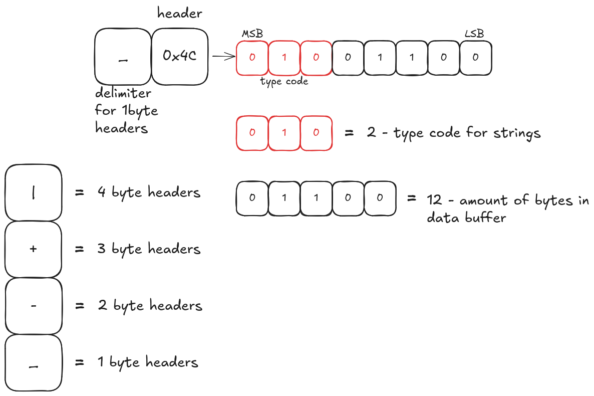
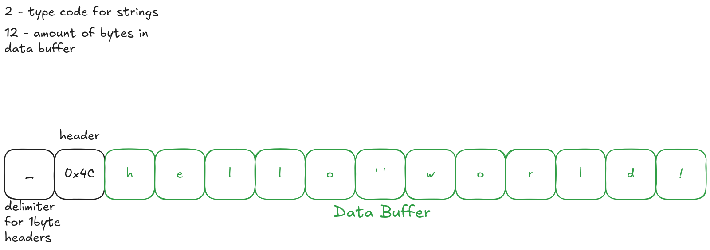
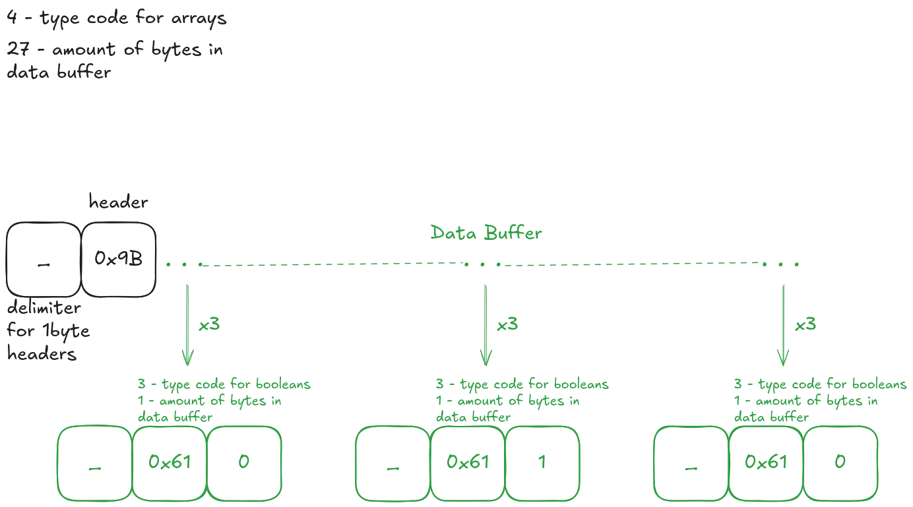

# THIS POST IN IN PROGRESS

# Writing a faster JSON compatible object serialization format in golang

## intro
JSON is by far the most popular serialization format in web development, whether its a RESTful API for serving clients or communication between distributed systems, JSON offers an extremely easy to use format for accomplishing that task, coupled with the fact that most runtimes implement the JSON parser, working in web means that you spend most of your time creating or reading from JSON objects.

JSON's most recognizable feature is its human readable design, JSON payloads can be easily read and understood without any de-serializer, but that human readable design makes it slow to serialize and deserialize, mostly due to the usage of redundant symbols and , its payload size is also considerably large, as it has to encode numbers(all defined as double precision floats) in strings, meaning a number like: '12345.67891' would be encoded in 11 bytes even though it could fit in 8 byte buffers.

JSON's second most recognizable feature is its brackets, every single object must start  with a '{' and close with a '}', meaning that parsers can't know where an object ends until it has been fully parsed, introducing some friction against parallelizing and partial parsing, this lead me to wonder if there is a middle point between binary formats(protobuf, cap'n proto, etc.) and text based formats(JSON, YAML, TOML, etc.).
## design
The design has 4 main goals to accomplish(on average):
- fully compatible with JSON objects, containing all the JSON types(null, boolean, number, string, array, object)
- encodes to a smaller payload than the JSON equivalent
- faster to encode than JSON
- faster to decode than JSON

### P.S: from now on 'object' will refer to the minimal serialization unit in JSON and PSON, not necessarily a javascript object.

The first feature in prefixed-JSON(from now on referred to as PSON) is the use of a leading delimiter, which is a single byte that encodes some information about the serialized object, but mostly exists as a validation step before deserializing any object or sub-object, after that comes anywhere from a single to 4 bytes, those bytes represent the size of the proceeding header, which contains information about the type of the serialized object and how many bytes it contains, the type code is stored in the top 3 bits of the header no matter its size, meaning that our first design downside is losing 3 bits from every header disallowing us from encoding extremely large objects with a practical upper bound on payload size of ~500MB, which is a reasonable downside to accept for the sake of achieving goal number 2.

### Primitives

The above example shows a complete begining block of any object in PSON, it starts with a delimiter byte, which is also used to determine the header size, while it could also fit within our header if we used bitpacking again to store a delimiter bit field inside of the header byte, it would eat more into the data buffer size range and would get rid of the main benefit of a delimiter, which is validation, as we only have 4 possible values for a delimiter, and everything outside of this range means either a faulty payload or a faulty deserializer, making implementing PSON easier for developers, and making it slightly more feasible to use through unstable network connections.

Reading the example block we see the `_` delimiter, and just like shown in the bottom left column, it means that we only need to consume the next byte to gain all the information we need about the object.
After we read the byte we have to extract our type code from the top 3 bits just as shown, with the bit order demonstrated by MSB(Most Significant Bit) and LSB(Least Significant Bit), after that we mask the type bits out of the header and interpret it again as the data buffer size, lastly we resolve the type code to a type through referencing this table:
- 0 : null
- 1 : number
- 2 : string
- 3 : boolean
- 4 : array
- 5 : object
- these are optional extensions and not a necessary part of PSON:
    - 6 : binary blob
    - 7 : custom type

Now we can see the entire payload, and since we are encoding a simple ascii string of known size, we can read it and determine its content: `hello world!`, right now we are done defining all primitives(null, number, string, boolean), since each type will follow the same pattern for encoding its value, null will have no data buffer, boolean will always be a single byte buffer, numbers in JSON spec are double precision floating points so they take 8 bytes to encode and strings as demonstrated have variable size and can take as much space as needed.

We encode a lot of redundant data for the sake of simplicity and to have uniform serialization/deserialization process, while still opening up room for extra features, like conditionally deserializing numbers based on how they are used(a small float can use 4 bytes instead of 8, a counter can be encoded as int instead of float, etc.).

### Arrays
Arrays are slightly more complicated than primitives, since we need to define them in such a way that they are able to contain every other type supported by JSON, instead of using special scope symbols we will rely on the size defined in the header to create a scope for our arrays, meaning that we can simply append the array's elements as we serialize the object, making serialization much faster.

Shown above is a complete array, and as shown child elements don't have a special shape but are represented as whole PSON objects, an element `E` could be said to be part of an array `A` if its completely contained within the data buffer range of `A` including its delimiter and its header, otherwise `E` is not considered a child element and may be deserialized differently, removing any special encoding rules as mentioned before will give a big boost to serialization times.
 
 Following the above rules we can start deserializing the array, we first look at the type code which is 4 for array and then the data buffer size which is 27 bytes, then we mark all bytes within the data buffer range and start serializing all PSON objects until that point, starting with the first element's header we deserialize it normally and resolve a boolean with value `0` which means `false`, we find 2 other similar booleans, then we deserialize the next 3 booleans all with value `1` meaning `true`, the last 3 are `false` booleans giving us in the end the following array: `[false, false, false, true, true, true, false, false, false]`, all without waiting for any symbol to signal the end of the array, meaning that this decision saved us time both at serialization time and deserialization time!

 ### Objects
 Objects are the most complex type, since every object element is made of two parts, a key(always a string) and a value(any PSON data type), giving us both an extra challenge and an oppurtunity to optimize the format.