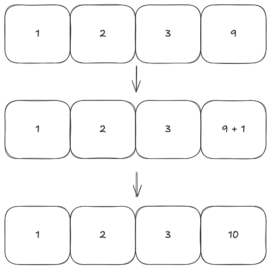
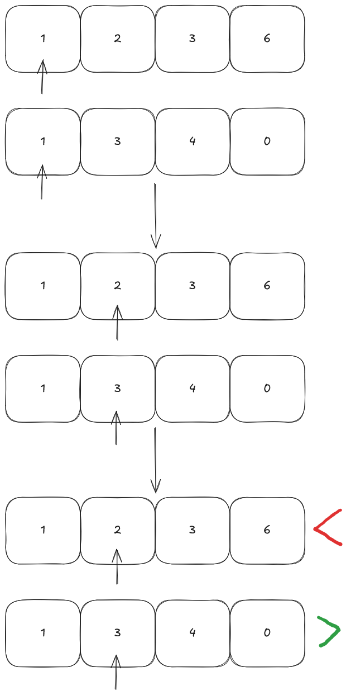

# Writing an arbitrary size integer type in C#

Sometimes you might see websites no longer being able to display some basic statistics about
a piece of content hosted there (e.g view counts, likes, interactions, etc) and instead
that figure would be replaced by something like: "4b+ views", what is the reason behind that?

I will try to blindly solve this problem, while attempting to optimize it.

---

## Part 0: How numbers are represented in the CPU

Feel free to skip this if you are familiar with computer science basics.

As is well known, computers use 1s and 0s (also called binary) to represent all values and logic, but how is
that done, and how does it relate to our problem?

On a piece of paper, when we write a number, we use the base 10 system, where every 10
numbers, we move to the next position, and we have 10 glyphs to represent all
values (0–9). Like when computing 7 + 9, we don’t have a unique glyph for it that
represents the value fourteen; instead we add the two values together until we have a number larger than 9,
then we move it to a new position and put the remaining value in the original position.

Applying the same rules to a base 2 number gives us binary numbers, which are the numbers
that can be computed by the CPU. Just like base 10 has 10 glyphs, base 2 has 2 glyphs
to represent all possible values (0, 1).

While it might seem impossible, if we apply the previous rules, you will find that it
holds true even for this small value.

Let’s try 1 + 1. Normally we’d write 2, but since we don’t have a glyph for that value,
we move it to the left and write the remainder in the original position, ending with `10`
(which represents 2). Now we can add one to two: `10 + 01` and end up
with `11` (which is 3 in binary).

We only explained why it’s possible to represent all possible numbers, not why it restricts the range
of values that websites can display — and that reason is: computers don’t use that system internally.

Instead, when computers store a number, they store all the available positions that number can use
to represent a value, and the most common number of positions used is 32. That’s why many languages call integers `i32`.
`i` means integer and `32` is how many bits that number contains.

We can calculate the range of all possible values for a given number of bits through this formula:

```
max = 2^(n) - 1
min = 0
```

Where `n` is the number of bits, giving us `(4,294,967,295 - 0)` for 32-bit numbers.

P.S: for simplicity we won’t discuss negatives — see [Wikipedia](https://en.wikipedia.org/wiki/Signed_number_representations).

---

## Part 1: Incrementing

To eliminate the issue related to limited-range number representations, we have to first create
a type that is made of something we can grow and use easily — in this case an array will
suffice. But an array of what?

### Possible types

- **String**: has issues related to restricting users from putting
  non-number characters in the string, and also writing all the arithmetic operations between
  number strings isn’t trivial. Using a `char` won’t solve this either.
- **Integer**: already implements arithmetic operations and is restricted to only numeric
  values; will also help us optimize our program later.

### Requirements

- Be able to describe any finite natural number  
- Be able to increment that number

Let’s take a number: `1239`. Once incremented we expect to find `1240`.  
To understand this, first break down the number into a list of digits, sorted from largest
to smallest position magnitude.

Lastly, we’ll simply add one to the smallest position each time, like this:

<details>
<summary>source_1.cs</summary>

```csharp
void print_number(int[] numbers)
{
    var temp = "";
    foreach (var num in numbers)
    {
        temp += $"[{num}]";
    }
    System.Console.WriteLine(temp);
}

void increment(int[] numbers)
{
    int least_significant_index = numbers.Length - 1;
    numbers[least_significant_index]++;
}

int[] numbers =
[
    1   // most significant position
    ,2
    ,3
    ,9  // least significant position
];

increment(numbers);

// prints: [1][2][3][10]
print_number(numbers);
```
</details>




We didn’t take into account how the values would propagate between positions.  
We’ll now detect and handle carries, like in a full adder.

For simplicity, we’ll use recursion to increment the least significant position and
propagate carries upward as needed.  
We’ll use a class to encapsulate the logic.

<details>
<summary>source_2.cs</summary>

```csharp
using System.Globalization;

class LargeNumber
{
    public int[] numbers;

    public LargeNumber(int[] numbers)
    {
        this.numbers = numbers;
    }

    // utility to automatically convert int's to LargeNumber's
    public LargeNumber(int number)
    {
        var str = number.ToString();

        this.numbers = new int[str.Length];
        for (int i = 0; i < this.numbers.Length; i++)
        {
            this.numbers[i] = int.Parse(str[i].ToString());
        }
    }

    public override String ToString()
    {
        var temp = "";
        foreach (var num in numbers)
        {
            temp += $"[{num}]";
        }
        return temp;
    }

    // recursion helper function
    public void increment()
    {
        int least_significant_index = numbers.Length - 1;
        _increment(least_significant_index);
    }

    private void _increment(int index)
    {
        // check for bounds
        if (index >= numbers.Length || index < 0)
        {
            return;
        }

        // increment
        numbers[index]++;

        // carry detection.
        if (numbers[index] > 9)
        {
            // the position loops around and sends the carry to the next position.
            numbers[index] = 0;

            // propogate carry
            this._increment(index - 1);
        }
    }
}

public class Program
{
    public static void Main()
    {
        LargeNumber number = new(1239);
        number.increment();

        // [1][2][4][0]
        System.Console.WriteLine(number);

        number = new LargeNumber(999);
        number.increment();

        // [0][0][0]
        System.Console.WriteLine(number);
    }
}

```
</details>


Now we’ve solved carry propagation — but `999` increments to `000`, which
means it overflowed. We must allow dynamic expansion of our number.

We’ll add an `expand()` function that grows the internal array when overflow happens,
making expansion trivial since the most significant digit has the higher index.  
We’ll also make `ToString()` return a normal number string.

<details>
<summary>source_3.cs</summary>

```csharp
using System.Globalization;

class LargeNumber
{
    public int[] numbers;

    public LargeNumber(int[] numbers)
    {
        this.numbers = numbers;
    }

    // utility to automatically convert int's to LargeNumber's
    public LargeNumber(int number)
    {
        var str = number.ToString();

        this.numbers = new int[str.Length];
        for (int i = 0; i < this.numbers.Length; i++)
        {
            this.numbers[numbers.Length - 1 - i] = int.Parse(str[i].ToString());
        }
    }

    public override String ToString()
    {
        var temp = "";
        foreach (var num in numbers)
        {
            temp = $"{num}{temp}";
        }
        return temp;
    }

    // recursion helper function
    public void increment()
    {
        int least_significant_index = 0;
        _increment(least_significant_index);
    }

    private void _increment(int index)
    {
        // check for overflow
        if (index >= numbers.Length)
        {
            expand();
        }

        // increment
        numbers[index]++;

        // carry detection.
        if (numbers[index] > 9)
        {
            // the position loops around and sends the carry to the next position.
            numbers[index] = 0;

            // propogate carry
            this._increment(index + 1);
        }
    }

    private void expand()
    {
        var new_numbers = new int[numbers.Length + 1];

        for (int i = 0; i < numbers.Length; i++)
        {
            new_numbers[i] = numbers[i];
        }

        this.numbers = new_numbers;
    }
}

public class Program
{
    public static void Main()
    {

        LargeNumber number = new LargeNumber(999);
        number.increment();

        // 1000
        System.Console.WriteLine(number);

        // demo of the object
        for (LargeNumber i = new(0); int.Parse(i.ToString()) < 10; i.increment())
            System.Console.WriteLine(i);
    }
}
```
</details>

Now we can increment our objects until we have no more room in memory.  
But it still feels awkward — we can’t decrement numbers yet or perform large additions.

---

## Part 2: Decrementing

Let’s start with the easiest case:

```
5 - 1 = 4
```

We simply subtract one from the least significant position.

<details>
<summary>source_4.cs</summary>

```csharp
// recursion helper function
public void decrement()
{
    _decrement(0);
}

private void _decrement(int index)
{
    numbers[index]--;
}

...

public static void Main()
{

    LargeNumber number = new LargeNumber(5);
    number.decrement();

    // 4
    System.Console.WriteLine(number);

    number = new LargeNumber(10);
    number.decrement();

    // 1-1
    System.Console.WriteLine(number);
}
```
</details>

The second number’s nonsensical output shows that this naive solution can’t propagate
decrementation correctly — so we’ll detect wraparounds (numbers going below 0).

<details>
<summary>source_5.cs</summary>

```csharp
// recursion helper function
public void decrement()
{
    _decrement(0);
}

private void _decrement(int index)
{
    // checking bounds
    if (index >= numbers.Length)
    {
        return;
    }

    numbers[index]--;

    // check for wraparound
    if (numbers[index] < 0)
    {
        numbers[index] = 9;
        _decrement(index + 1);
    }


}

...

public static void Main()
{

    LargeNumber number = new LargeNumber(999);
    number.decrement();

    // 998
    System.Console.WriteLine(number);

    number = new LargeNumber(10);
    number.decrement();

    // 09
    System.Console.WriteLine(number);

    // demo for decrementing value
    for (var num = new LargeNumber(435); int.Parse(num.ToString()) > 0; num.decrement())
        /*Do something*/
        ;
}
```
</details>

Now we see both `998` and `09`, which are correct results.

Just like the increment logic, we wrap around to 9 and don’t expand
the number for decrements (to avoid infinite recursion).

At this point, all natural-number arithmetic operations are theoretically possible:
addition, subtraction, multiplication (grouped addition), and division (grouped subtraction).

<details>
<summary>source_6.cs</summary>

```csharp
public class Program
{

    static LargeNumber NaiveSum(LargeNumber a, LargeNumber b)
    {
        LargeNumber c = new(a);

        // simulated addition
        for (LargeNumber i = new(0); int.Parse(i.ToString()) < int.Parse(b.ToString()); i.increment())
            c.increment();

        return c;
    }

    public static void Main()
    {

        Stopwatch timer = new();
        timer.Start();
        LargeNumber a = new(123);
        LargeNumber b = new(654);

        // 777
        var c = NaiveSum(a, b);
        timer.Stop();
        var time_a = timer.Elapsed;

        timer.Restart();
        a = new(1000000);
        b = new(1000000);

        // 2,000,000
        c = NaiveSum(a, b);
        timer.Stop();
        var time_b = timer.Elapsed;

        // ~5ms
        System.Console.WriteLine(time_a);

        // ~700ms
        System.Console.WriteLine(time_b);

    }
}
```
</details>

This is where the use of integer types over strings to represent our positions becomes
useful, as we can simply replace `int`s with `byte`, which is a type that is only 8 bits large.
This improves memory efficiency and potentially cache locality.

<details>
<summary>source_7.cs</summary>

```csharp
class LargeNumber
{
    public byte[] numbers;
...
```
</details>

---

## Part 3: Summation and Comparison

We’ll now add proper **comparison** and **summation**.

### Comparison

To fix performance, we’ll overload `>` and `<` operators in C# to allow
direct comparison between two numbers.

We’ll start from the most significant position, allowing early exits when a difference is found.

<details>
<summary>source_8.cs</summary>

```csharp
...
// skip preceding zeros
if (a.numbers.Length > b.numbers.Length)
{
    var curr = a.numbers[a.numbers.Length - 1];
    while (curr == 0 && (a.numbers.Length - current_a) > b.numbers.Length)
    {
        current_a++;
        curr = a.numbers[a.numbers.Length - 1 - current_a];
    }
}
else if (b.numbers.Length > a.numbers.Length)
{
    var curr = b.numbers[b.numbers.Length - 1];
    while (curr == 0 && (b.numbers.Length - current_b) > a.numbers.Length)
    {
        current_b++;
        curr = b.numbers[b.numbers.Length - 1 - current_b];
    }
}
...
```
</details>

We’ll skip preceding zeros, then compare lengths, and finally compare positions.

<details>
<summary>source_9.cs</summary>

```csharp
public static bool operator >(LargeNumber a, LargeNumber b)
{
    int current_a = 0;
    int current_b = 0;

    // skip preceding zeros
    if (a.numbers.Length > b.numbers.Length)
    {
        var curr = a.numbers[a.numbers.Length - 1];
        while (curr == 0 && (a.numbers.Length - current_a) > b.numbers.Length)
        {
            current_a++;
            curr = a.numbers[a.numbers.Length - 1 - current_a];
        }
    }
    else if (b.numbers.Length > a.numbers.Length)
    {
        var curr = b.numbers[b.numbers.Length - 1];
        while (curr == 0 && (b.numbers.Length - current_b) > a.numbers.Length)
        {
            current_b++;
            curr = b.numbers[b.numbers.Length - 1 - current_b];
        }
    }

    if (a.numbers.Length > b.numbers.Length)
        return true;
    else if (a.numbers.Length < b.numbers.Length)
        return false;

    // after all early exists check the values
    var length_remaining = a.numbers.Length - current_a;
    for (int i = 0; i < length_remaining; i++)
    {
        var a_current = a.numbers[a.numbers.Length - 1 - (current_a + i)];
        var b_current = b.numbers[b.numbers.Length - 1 - (current_b + i)];

        if (a_current > b_current)
            return true;
        else if (a_current == b_current)
            continue;
        else if (a_current < b_current)
            return false;
    }

    return false;
}

public static bool operator <(LargeNumber a, LargeNumber b)
{
    int current_a = 0;
    int current_b = 0;

    // skip preceding zeros
    if (a.numbers.Length > b.numbers.Length)
    {
        var curr = a.numbers[a.numbers.Length - 1];
        while (curr == 0 && (a.numbers.Length - current_a) > b.numbers.Length)
        {
            current_a++;
            curr = a.numbers[a.numbers.Length - 1 - current_a];
        }
    }
    else if (b.numbers.Length > a.numbers.Length)
    {
        var curr = b.numbers[b.numbers.Length - 1];
        while (curr == 0 && (b.numbers.Length - current_b) > a.numbers.Length)
        {
            current_b++;
            curr = b.numbers[b.numbers.Length - 1 - current_b];
        }
    }

    if (a.numbers.Length < b.numbers.Length)
        return true;
    else if (a.numbers.Length > b.numbers.Length)
        return false;

    // after all early exists check the values
    var length_remaining = a.numbers.Length - current_a;
    for (int i = 0; i < length_remaining; i++)
    {
        var a_current = a.numbers[a.numbers.Length - 1 - (current_a + i)];
        var b_current = b.numbers[b.numbers.Length - 1 - (current_b + i)];

        if (a_current < b_current)
            return true;
        else if (a_current == b_current)
            continue;
        else if (a_current > b_current)
            return false;
    }

    return false;
}
```
</details>


Performance improves drastically — large-number addition now runs >20× faster.



### Summation

We re-adapt the increment logic to work for large-number addition with proper carry propagation.

<details>
<summary>source_10.cs</summary>

```csharp
public static LargeNumber operator +(LargeNumber a, LargeNumber b)
{
    int larger_length = (a.numbers.Length > b.numbers.Length) ? a.numbers.Length : b.numbers.Length;
    int smaller_length = (a.numbers.Length < b.numbers.Length) ? a.numbers.Length : b.numbers.Length;
    var c_arr = new byte[larger_length];
    var c = new LargeNumber(c_arr);

    int a_current;
    int b_current;
    bool carry = false;

    for (int i = 0; i < smaller_length; i++)
    {
        a_current = a.numbers[i];
        b_current = b.numbers[i];

        int sum = a_current + b_current
        + (carry ? 1 : 0); // take carry into account
        carry = false; // reset carry signal

        // detect carry
        if (sum > 9)
        {
            carry = true;
            sum -= 10;
        }

        c.numbers[i] = (byte)sum;
    }

    // move the remaining values
    var larger_number = (a.numbers.Length > b.numbers.Length) ? a : b;
    for (int i = smaller_length; i < larger_length; i++)
    {
        c.numbers[i] = larger_number.numbers[i];
    }

    // handling trailing carry
    if (carry)
    {
        c.expand();
        c.numbers[c.numbers.Length - 1]++;
    }

    return c;
}
```
</details>

This almost-constant-time solution scales much better with large numbers.

---

## Part 3.2: Leftovers

There are still some operations we haven’t implemented yet:

- Subtraction  
- Equality (`==` and `!=`)

### Subtraction

Like summation, but subtracting 10 when a borrow occurs, and propagating `-1`.

<details>
<summary>source_11.cs</summary>

```csharp
public static LargeNumber operator -(LargeNumber a, LargeNumber b)
{
    // early exit, our type doesn't support negatives
    if (a < b)
    {
        return new(0);
    }

    int larger_length = (a.numbers.Length > b.numbers.Length) ? a.numbers.Length : b.numbers.Length;
    int smaller_length = (a.numbers.Length < b.numbers.Length) ? a.numbers.Length : b.numbers.Length;
    var c_arr = new byte[larger_length];
    var c = new LargeNumber(c_arr);

    int a_current;
    int b_current;
    bool carry = false;

    for (int i = 0; i < smaller_length; i++)
    {
        a_current = a.numbers[i];
        b_current = b.numbers[i];

        int diff = a_current - b_current
        - (carry ? 1 : 0); // take carry into account
        carry = false; // reset carry signal

        // detect carry
        if (diff > 9)
        {
            carry = true;
            diff += 10;
        }

        c.numbers[i] = (byte)diff;
    }

    // move the remaining values
    var larger_number = (a.numbers.Length > b.numbers.Length) ? a : b;
    for (int i = smaller_length; i < larger_length; i++)
    {
        c.numbers[i] = larger_number.numbers[i];
    }

    return c;
}
```
</details>

### Equality

Similar to comparison, but checks for perfect match.

<details>
<summary>source_12.cs</summary>

```csharp
public static bool operator !=(LargeNumber a, LargeNumber b)
{
    int current_a = 0;
    int current_b = 0;

    // skip preceding zeros
    if (a.numbers.Length > b.numbers.Length)
    {
        var curr = a.numbers[a.numbers.Length - 1];
        while (curr == 0 && (a.numbers.Length - current_a) > b.numbers.Length)
        {
            current_a++;
            curr = a.numbers[a.numbers.Length - 1 - current_a];
        }
    }
    else if (b.numbers.Length > a.numbers.Length)
    {
        var curr = b.numbers[b.numbers.Length - 1];
        while (curr == 0 && (b.numbers.Length - current_b) > a.numbers.Length)
        {
            current_b++;
            curr = b.numbers[b.numbers.Length - 1 - current_b];
        }
    }

    // early exit
    if ((a.numbers.Length - current_a) != (b.numbers.Length - current_b))
    {
        return false;
    }

    // check for the first different pair
    for (int i = 0; i < a.numbers.Length - current_a; i++)
    {
        if (a.numbers[a.numbers.Length - 1 - i] != b.numbers[b.numbers.Length - 1 - i]) return true;
    }

    return false;
}

public static bool operator ==(LargeNumber a, LargeNumber b)
{
    var result = a != b;
    return result;
}
```
</details>

---

## Conclusion

This was an attempt at solving a deceptively hard problem:
designing and optimizing an arbitrary-size integer type to reach nanosecond-level performance,
which would require more advanced techniques like bit-packing, SIMD, and branchless logic.

The complete program is available below (code quality questionable, but illustrative):

[Download](source_13.cs)
